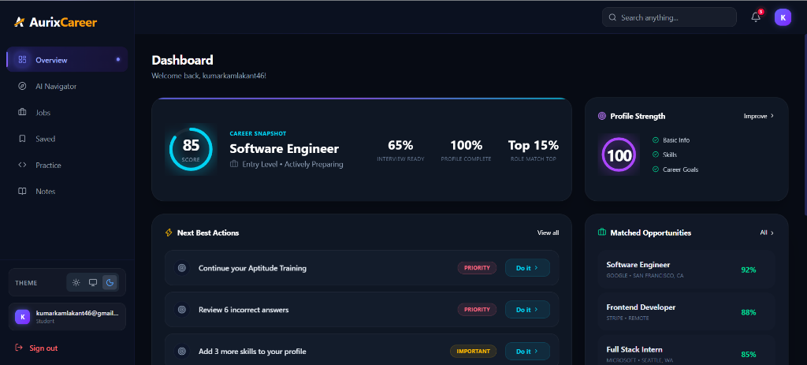
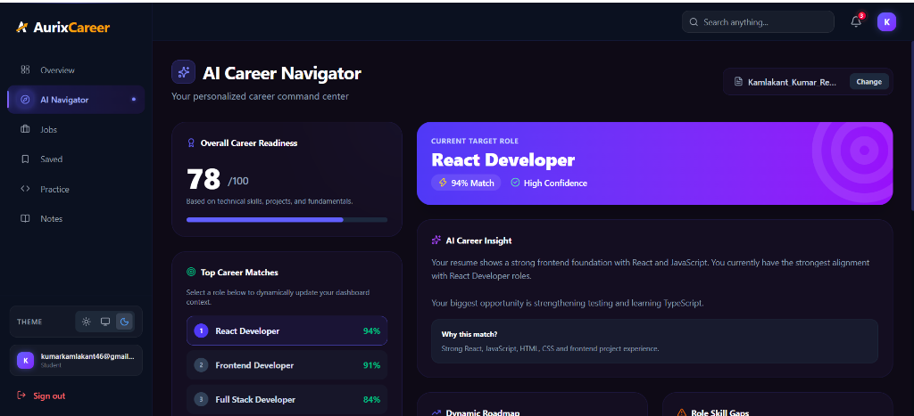
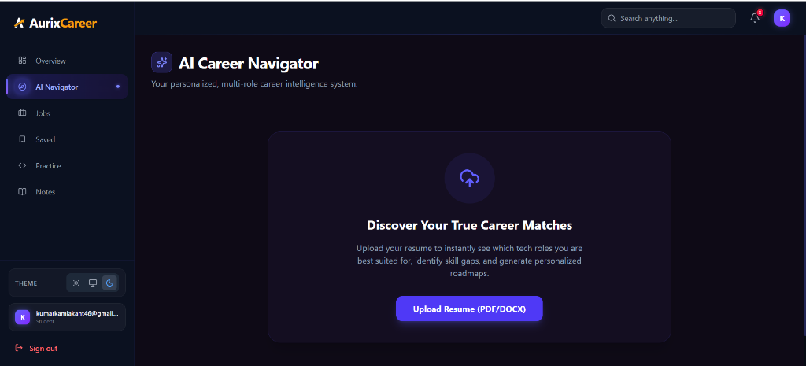
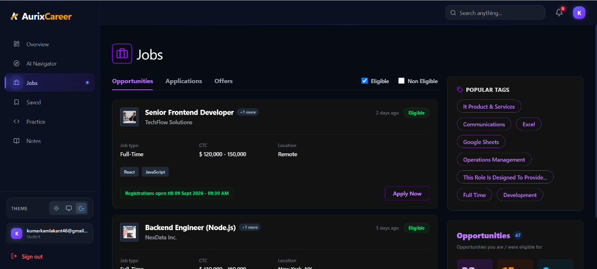
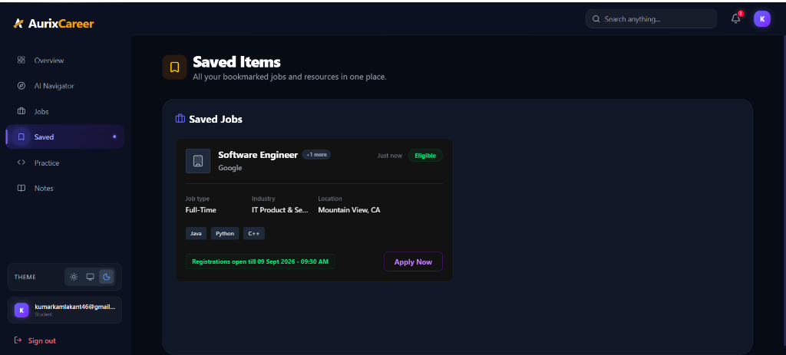

# Next-Gen Recruitment & Student Prep Platform

A modern, full-stack application designed to bridge the gap between talented students and top recruiters. This platform empowers students to build compelling profiles, track their skill development, and apply for jobs, while providing recruiters with AI-driven insights to find the best-matched candidates efficiently.

## 🚀 Features

### ✨ Beautiful 3D User Interface


### For Students
- **Smart Profile Building**: Create a comprehensive portfolio highlighting skills, projects, and education.
- **AI Career Navigator**: Get personalized insights and career readiness scores.
  
  
- **Skill Assessments & Practice**: Take assessments to prove proficiency and track problem-solving progress.
- **Job Discovery**: Browse and apply for tailored job opportunities.
  
- **Saved Opportunities**: Keep track of roles you're interested in.
  

### For Recruiters
- **AI Hiring Insights**: Instantly identify top-matched candidates for active job postings with automated match scores.
- **Job Management**: Create and manage job postings with custom requirements and screening questions.
- **Candidate Tracking**: Efficiently manage applications through various stages (Review, Shortlisted, Interview, Hired).
- **Dashboard Analytics**: Gain actionable insights with visual trends on applications and candidate engagement.

## 💻 Tech Stack

### Frontend
- **Framework**: React 19 with Vite
- **Styling**: Tailwind CSS v4 & Tailwind Merge
- **State Management**: Zustand
- **Data Fetching & Caching**: TanStack React Query & Axios
- **Form Handling**: React Hook Form & Zod Validation
- **Charts & UI**: Recharts & Lucide React Icons

### Backend
- **Environment**: Node.js & Express.js
- **Database & ORM**: Prisma ORM with SQLite
- **Authentication**: JWT & bcrypt
- **Real-time**: Socket.io
- **Security**: Helmet & CORS

## 🛠️ Getting Started

### Prerequisites
- [Node.js](https://nodejs.org/) (v18 or higher recommended)
- npm or yarn

### Installation

1. **Clone the repository**
   ```bash
   git clone <repository-url>
   cd pp
   ```

2. **Setup the Backend**
   ```bash
   cd backend
   npm install
   
   # Setup Prisma and Database
   npx prisma generate
   npx prisma db push
   
   # Start the development server
   npm run dev
   ```
   *The backend will run on http://localhost:5000 (or your configured PORT).*

3. **Setup the Frontend**
   Open a new terminal window:
   ```bash
   cd frontend
   npm install
   
   # Start the frontend application
   npm run dev
   ```
   *The frontend will run on http://localhost:5173.*

## 📂 Project Structure

```
├── backend/
│   ├── prisma/             # Database schema and SQLite db
│   ├── src/
│   │   ├── config/         # Environment and DB configuration
│   │   ├── controllers/    # Request handlers (Auth, Recruiter, Student, etc.)
│   │   ├── middleware/     # Custom middlewares (Auth, Error handling)
│   │   ├── routes/         # Express API routes
│   │   └── index.js        # Entry point for backend
│   └── package.json
│
├── frontend/
│   ├── src/
│   │   ├── components/     # Reusable UI components
│   │   ├── pages/          # Route components (Dashboard, Profile, etc.)
│   │   ├── services/       # API interaction layer
│   │   ├── stores/         # Zustand global state
│   │   ├── App.jsx         # Main application component
│   │   └── main.jsx        # Entry point for frontend
│   └── package.json
└── README.md
```

## 🔒 Environment Variables

Create a `.env` file in the `backend/` directory with the following configuration:
```env
PORT=5000
JWT_SECRET=your_super_secret_jwt_key
```

*(Add any additional variables your platform requires, such as database URLs if migrating from SQLite to PostgreSQL).*

## 🤝 Contributing
Contributions, issues, and feature requests are welcome! Feel free to check the issues page.

## 📝 License
This project is licensed under the ISC License.
