# Next-Gen Recruitment & Student Prep Platform

A modern, full-stack application designed to bridge the gap between talented students and top recruiters. This platform empowers students to build compelling profiles, track their skill development, and apply for jobs, while providing recruiters with AI-driven insights to find the best-matched candidates efficiently.

---

## 📖 Project Overview

This platform is a two-sided marketplace connecting **students** who are preparing for and applying to jobs, with **recruiters** who are trying to find the best-fit talent quickly.

- **Students** get a single place to build their profile, sharpen their skills through practice and assessments, get AI-powered career guidance, and discover/apply to jobs that match their strengths.
- **Recruiters** get a dashboard with analytics, AI-driven candidate matching, job posting management, and an end-to-end applicant tracking workflow — from application review to hiring.

The goal is to reduce the friction and guesswork on both sides of the hiring process: students know exactly where they stand and what to improve, while recruiters spend less time sifting through irrelevant applications and more time talking to the right candidates.

### ✨ Beautiful 3D User Interface
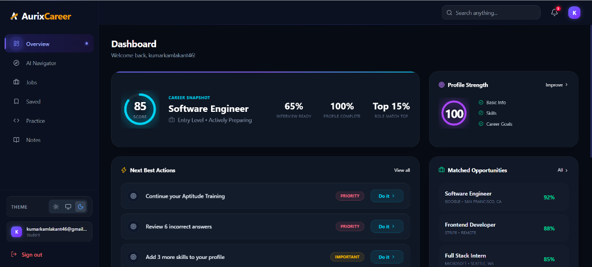

---

## 🚀 Features

### For Students

- **Smart Profile Building**
  Create a comprehensive portfolio highlighting skills, projects, and education — everything a recruiter needs to evaluate you at a glance.

- **AI Career Navigator**
  Get personalized insights and a career readiness score, along with resume feedback powered by AI.
  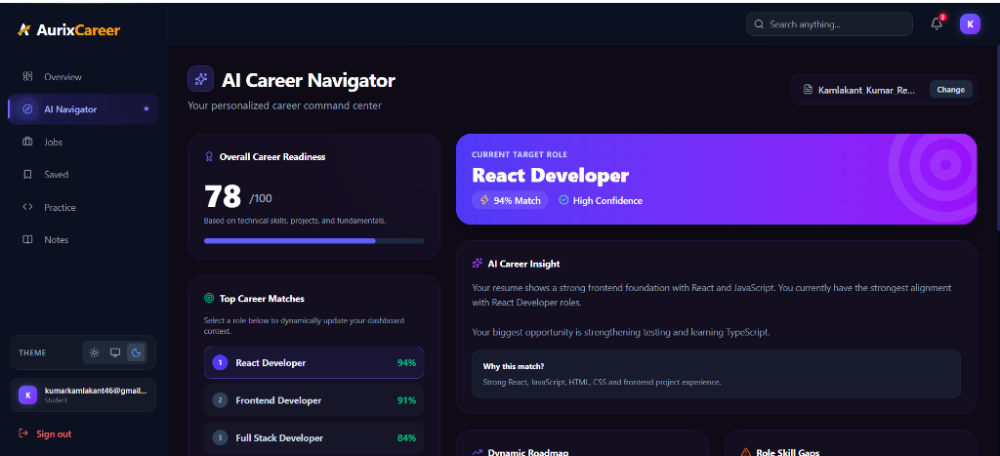
  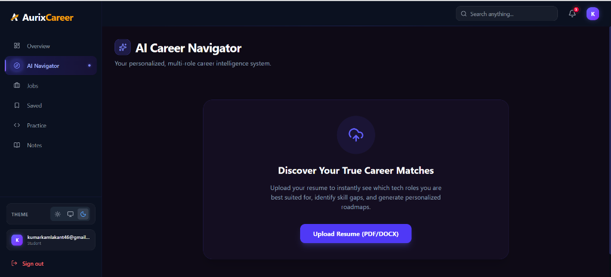

- **Skill Assessments & Practice**
  Take assessments to prove proficiency, solve practice problems, and track your problem-solving progress over time. Keep notes alongside your practice sessions.
  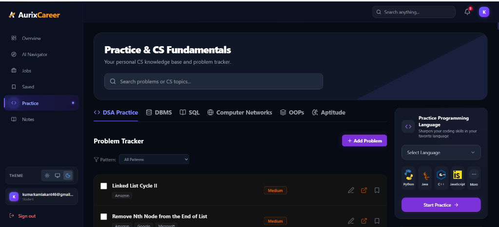
  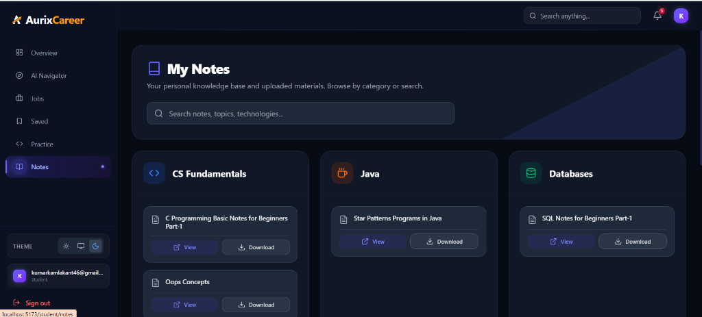

- **Job Discovery**
  Browse and apply for tailored job opportunities matched to your profile and skillset.
  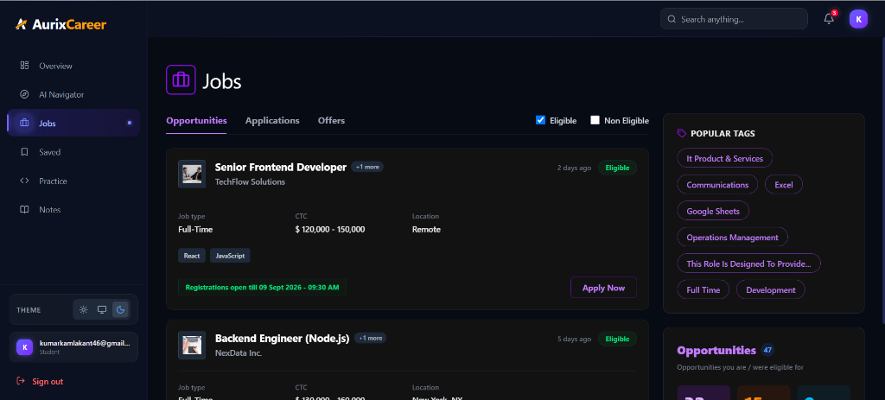

- **Saved Opportunities**
  Bookmark and keep track of roles you're interested in for later.
  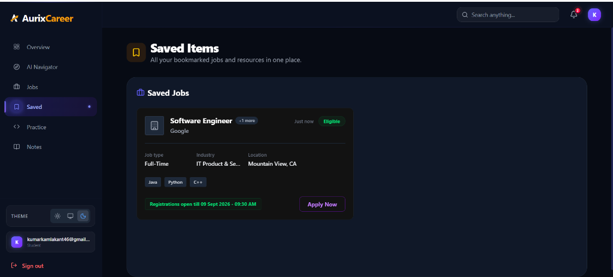

### For Recruiters

- **Dashboard Analytics**
  Gain actionable insights with visual trends on applications and candidate engagement.
  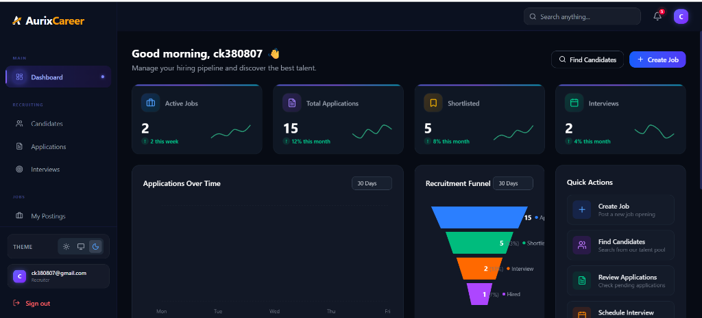

- **AI Hiring Insights**
  Instantly identify top-matched candidates for active job postings with automated match scores.
  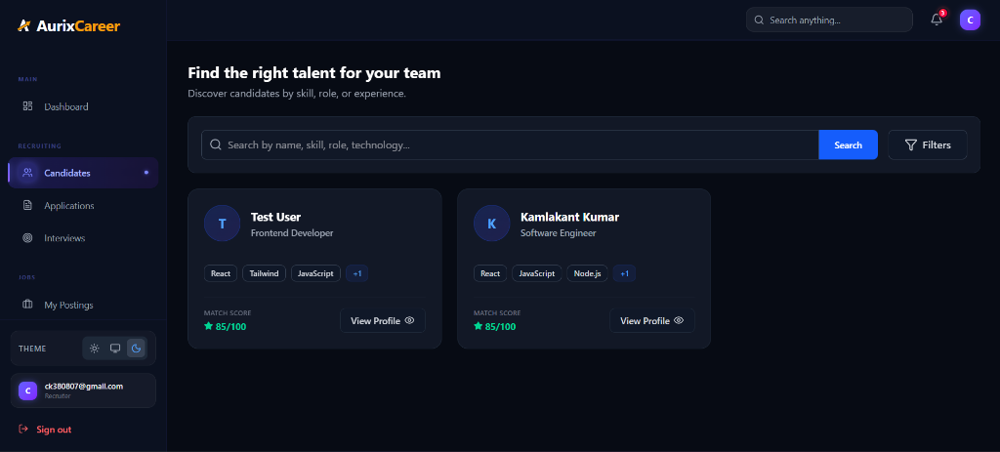

- **Job Management**
  Create and manage job postings with custom requirements and screening questions.
  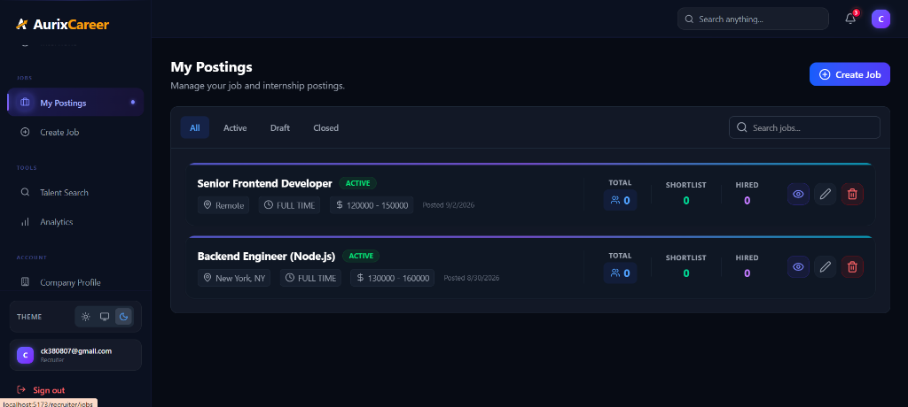

- **Candidate Tracking**
  Efficiently manage applications through various stages — Review, Shortlisted, Interview, Hired.

- **Notifications & Updates**
  Stay on top of your hiring pipeline with real-time application and interview notifications.
  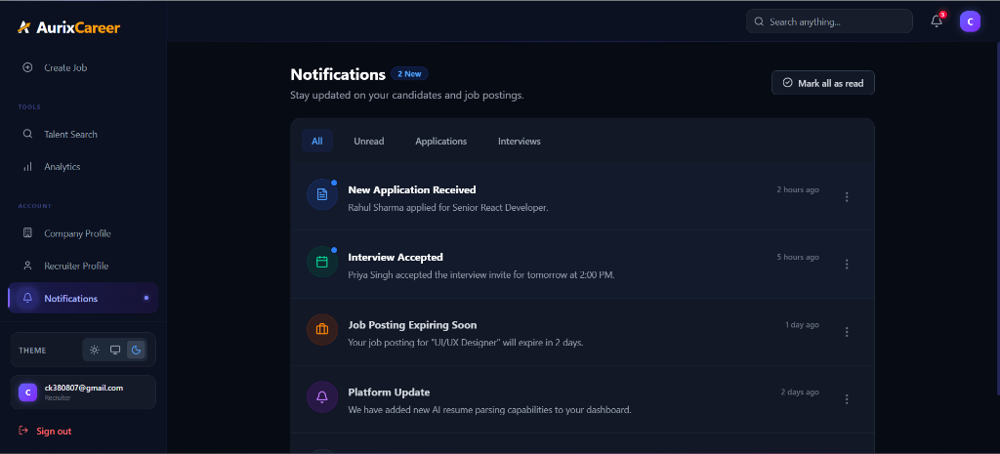

---

## 💻 Tech Stack

### Frontend
| Category | Technology |
|---|---|
| Framework | React 19 with Vite |
| Styling | Tailwind CSS v4 & Tailwind Merge |
| State Management | Zustand |
| Data Fetching & Caching | TanStack React Query & Axios |
| Form Handling | React Hook Form & Zod Validation |
| Charts & UI | Recharts & Lucide React Icons |

### Backend
| Category | Technology |
|---|---|
| Environment | Node.js & Express.js |
| Database & ORM | Prisma ORM with SQLite |
| Authentication | JWT & bcrypt |
| Real-time | Socket.io |
| Security | Helmet & CORS |

---

## 🛠️ Getting Started

### Prerequisites

Before you begin, make sure you have the following installed on your system:

- [Node.js](https://nodejs.org/) (v18 or higher recommended)
- npm (comes with Node.js) or yarn
- Git

You can verify your installations with:
```bash
node -v
npm -v
git --version
```

### Installation

Follow these steps in order to get the full application (backend + frontend) running locally.

#### 1. Clone the repository
```bash
git clone <repository-url>
cd pp
```

#### 2. Setup the Backend

Navigate to the backend directory and install dependencies:
```bash
cd backend
npm install
```

Create your environment file (see [Environment Variables](#-environment-variables) below), then set up the database using Prisma:
```bash
# Generate the Prisma client based on your schema
npx prisma generate

# Push the schema to your SQLite database (creates the DB if it doesn't exist)
npx prisma db push
```

Start the backend development server:
```bash
npm run dev
```
The backend will run on **http://localhost:5000** (or your configured `PORT`).

> 💡 Tip: You can open Prisma Studio to visually inspect/edit your database with:
> ```bash
> npx prisma studio
> ```

#### 3. Setup the Frontend

Open a **new terminal window/tab**, then:
```bash
cd frontend
npm install
```

Start the frontend application:
```bash
npm run dev
```
The frontend will run on **http://localhost:5173**.

#### 4. Verify everything works

- Open `http://localhost:5173` in your browser — you should see the app's landing/login page.
- Confirm the frontend can talk to the backend by trying to sign up / log in.
- If you run into CORS or connection errors, double-check that the backend is running and that the frontend's API base URL matches your backend's `PORT`.

---

## 📂 Project Structure

```
├── backend/
│   ├── prisma/             # Database schema and SQLite db
│   ├── src/
│   │   ├── config/         # Environment and DB configuration
│   │   ├── controllers/    # Request handlers (Auth, Recruiter, Student, etc.)
│   │   ├── middleware/     # Custom middlewares (Auth, Error handling)
│   │   ├── routes/         # Express API routes
│   │   └── index.js        # Entry point for backend
│   └── package.json
│
├── frontend/
│   ├── src/
│   │   ├── components/     # Reusable UI components
│   │   ├── pages/          # Route components (Dashboard, Profile, etc.)
│   │   ├── services/       # API interaction layer
│   │   ├── stores/         # Zustand global state
│   │   ├── App.jsx         # Main application component
│   │   └── main.jsx        # Entry point for frontend
│   └── package.json
└── README.md
```

---

## 🔒 Environment Variables

Create a `.env` file in the `backend/` directory with the following configuration:
```env
PORT=5000
JWT_SECRET=your_super_secret_jwt_key
```

*(Add any additional variables your platform requires, such as database URLs if migrating from SQLite to PostgreSQL.)*

---

## 🤝 Contributing
Contributions, issues, and feature requests are welcome! Feel free to check the issues page.

## 📝 License
This project is licensed under the ISC License.
